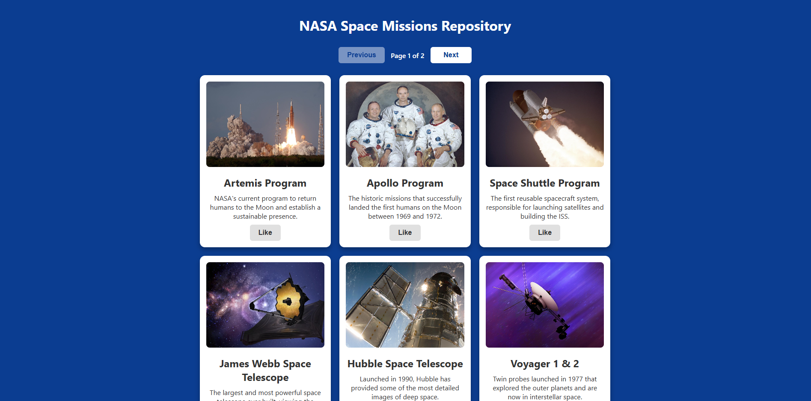
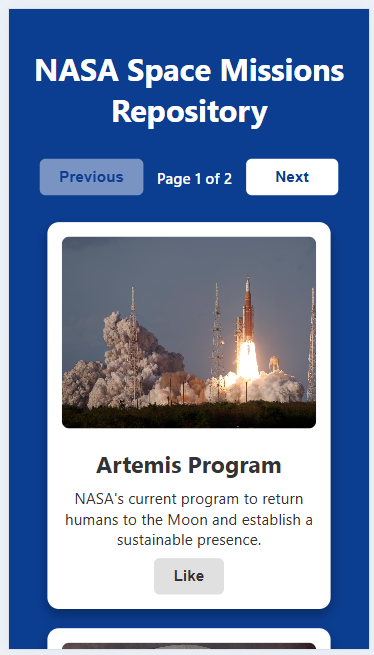

# NASA Space Missions Repository — Explorador Dinamico de Datos Aeroespaciales

[](https://reactjs.org/)
[](https://developer.mozilla.org/en-US/docs/Web/JavaScript)
[](https://vitejs.dev/)
[](https://www.w3.org/Style/CSS/)

> **Una Single Page Application (SPA) de alto rendimiento diseñada para centralizar, gestionar y visualizar información técnica de las misiones más emblemáticas de la NASA con una arquitectura de componentes escalable.**

---

## Descripcion del Problema

La divulgación de hitos científicos complejos a menudo se ve obstaculizada por interfaces saturadas que dificultan la retención de información. Los usuarios que buscan datos específicos sobre misiones espaciales requieren una plataforma que combine rigor técnico con una navegación fluida y jerarquizada.

**NASA Space Missions Repository** resuelve este problema mediante una arquitectura orientada a la experiencia de usuario (UX). El sistema procesa un repositorio de datos estructurado y lo presenta a través de una interfaz interactiva que implementa una lógica de fragmentación de contenido. Esto permite que misiones que abarcan décadas de historia sean consultadas de forma segmentada, clara y visualmente atractiva.

## Stack Tecnologico

El proyecto se construyó priorizando la modularidad y la eficiencia en el renderizado del lado del cliente:

* **Frontend**: React.js utilizando Hooks (useState) para la gestión de estados reactivos.
* **Logica de Negocio**: JavaScript (ES6+) para el manejo de colecciones de datos y algoritmos de paginación.
* **Arquitectura Visual**: CSS3 con un enfoque en Responsive Grid Design y una paleta de colores institucional inspirada en el espacio.
* **Estructura de Datos**: Módulo de datos exportable que actúa como una capa de persistencia para facilitar la escalabilidad del catálogo.



## Funcionalidades Clave

* **Navegacion Segmentada**: Control de flujo mediante botones de navegación que gestionan el estado de la página actual y previenen desbordamientos de índice.
* **Visualizacion de Alta Fidelidad**: Tarjetas con normalización de imágenes mediante propiedades de CSS para mantener la estética visual sin distorsiones.
* **Feedback Interactivo**: Sistema de botones con estados dinámicos y transformaciones que proporcionan una respuesta visual inmediata al usuario.
* **Escalabilidad de Contenido**: Arquitectura desacoplada que permite actualizar el repositorio de misiones sin alterar la lógica del frontend.



## Instalacion y Uso

Si deseas explorar este proyecto en tu entorno local, sigue estos pasos:

1. Clona el repositorio:
   ```bash
   git clone [https://github.com/valnorena/NASA-cards-react](https://github.com/valnorena/NASA-cards-react.git)